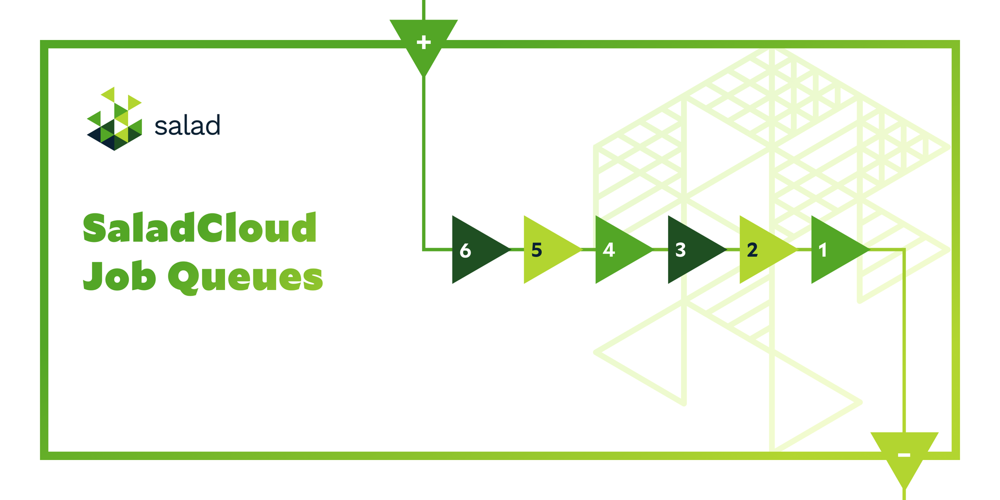

# SaladCloud Job Queue Worker

  

This project contains the SaladCloud Job Queue Worker, SDK, and samples. Refer to the [Job Queues documentation](https://docs.salad.com/container-engine/job-queues) for more information on using this with your SaladCloud-deployed workloads.
